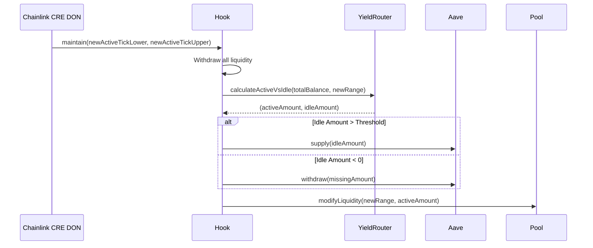

# Sentinel Liquidity Protocol: Agent Context

This document is the **Source of Truth** for AI coding agents (Copilot, Cursor, etc.) working on the Sentinel Liquidity Protocol. It defines the architecture, critical paths, and development standards.

## 1. Project Identity
**Name:** Sentinel Liquidity Protocol
**Type:** Trust-Minimized Agentic Liquidity Management for Uniswap v4.
**Core Mechanic:** Hybrid architecture combining an **Immutable On-Chain Hook** (Safety) with the **Chainlink Runtime Environment (CRE)** (Strategy).

## 2. Visual Architecture

### System Overview
```mermaid
graph TD
    User((User)) -->|Swap| Pool[Uniswap v4 Pool]
    Pool -->|beforeSwap| Hook[SentinelHook.sol]
    Hook -->|TickCrossed Event| CRE[Chainlink CRE DON]
    
    subgraph On-Chain "Hot Path"
        Hook -- Check Price --> Oracle[OracleLib]
        Hook -- Check Deviation --> Revert{Safe?}
        Revert -- No --> Fail[Revert Tx]
    end
    
    subgraph Off-Chain "Cold Path - Chainlink CRE"
        CRE -- Trigger --> Workflow[Sentinel Workflow]
        Workflow -- Fetch --> MarketData[External Data Source]
        Workflow -- Compute --> Consensus{Consensus?}
        Consensus -- Yes --> Execute[Submit Tx]
    end
    
    Execute -->|maintain()| Hook
    Hook -->|Deposit Idle| Aave[Aave / Morpho]
    Hook -->|Mint New Range| Pool
```

### Rebalancing Flow (CRE Orchestrated)

### User Entry point

```mermaid
User initiates a swap on Uniswap v4 Pool
           ↓
    SentinelHook.beforeSwap() is triggered
           ↓
    ✓ Oracle Price Deviation Check (Circuit Breaker)
           ↓
    ✓ If safe: Swap proceeds normally
    ✗ If unsafe: Swap reverts
```

### Lp Interaction flow

```mermaid
LP provides initial liquidity to the Sentinel-managed pool
                    ↓
        Capital is locked in SentinelHook
                    ↓
   Hook splits capital into two buckets:
   ├── Active: Deployed in narrow Uniswap range
   └── Idle: Earning yield in Aave lending protocol
```
## 3. The Golden Rules for AI Agents
If you are an AI generating code for this project, you **MUST** adhere to these rules.

1.  **Trust No Individual, Trust the Network:** The off-chain strategy is executed by a decentralized network (DON), not a single server.
2.  **The "Hot Path" is Sacred:** The `beforeSwap` hook runs on *every single user trade*.
    *   **Do not** add external calls (except to pre-approved Oracles).
    *   **Do not** write to storage unless absolutely necessary (events are cheaper).
3.  **Oracle Guardrails are Immutable:** The contract must verify safety parameters regardless of what the CRE inputs.
4.  **Yield is Secondary to Safety:** If Aave integration fails (e.g., paused protocol), the system must fallback gracefully.
5.  **Test in Fork:** Use `forge test --fork-url` to simulate the Mainnet/Base environment.

## 4. Architecture Deep Dive

### A. The Hot Path (On-Chain Guardrails)
*   **Component:** `SentinelHook.sol`
*   **Trigger:** `beforeSwap`
*   **Logic:**
    *   Cheaply validates price deviation using `OracleLib`.
    *   Emits `TickCrossed` to signal the CRE.

### B. The Cold Path (Chainlink CRE)
*   **Component:** **CRE Workflow** (replaces legacy `bot.ts`)
*   **Reference:** [Chainlink CRE Reference](./docs/chainlink_cre.md)
*   **Responsibility:**
    *   **Orchestration:** Monitors the chain and external markets.
    *   **Consensus:** A decentralized network agrees on the *Volatility Strategy* output before submitting the transaction.
    *   **Security:** Removes the single point of failure of a private key.

### C. Trust Minimization Philosophy
The **Chainlink CRE** acts as the "Strategist".
*   **Custodian:** NONE. (Funds are locked in the immutable Hook).
*   **Strategist:** The CRE DON has the right to call `maintain()`, but only within the mathematical bounds enforced by the Hook.

## 5. Codebase Map & Critical Files

### Contracts (`/contracts`)
| File                            | Role            | Key Functionality                                                                   |
| :------------------------------ | :-------------- | :---------------------------------------------------------------------------------- |
| `src/SentinelHook.sol`          | **Core**        | `beforeSwap` (Guard), `maintain` (Rebalance), `_handleIdleCapital` (Yield routing). |
| `src/libraries/OracleLib.sol`   | **Safety**      | `checkPriceDeviation()` using Chainlink/TWAP.                                       |
| `src/libraries/YieldRouter.sol` | **Math**        | `calculateIdealRatio()`, segregates Active vs. Idle funds.                          |
| `src/libraries/AaveAdapter.sol` | **Integration** | `depositToAave()`, `withdrawFromAave()`. Wraps `IPool`.                             |

### Workflows (`/workflows` - Conceptual)
| File                    | Role              | Key Functionality                                                |
| :---------------------- | :---------------- | :--------------------------------------------------------------- |
| `SentinelWorkflow.yaml` | **Orchestration** | Defines the Trigger -> Compute -> Consensus -> Execute pipeline. |

## 6. External Resources & Docs
*   **Chainlink CRE Reference:** [Local Docs](./docs/chainlink_cre.md)
*   **Uniswap v4 Docs:** [https://docs.uniswap.org/contracts/v4/overview](https://docs.uniswap.org/contracts/v4/overview)
*   **Aave v3 Docs:** [https://docs.aave.com/developers/](https://docs.aave.com/developers/)

---
*Created by Antigravity for automated context.*
