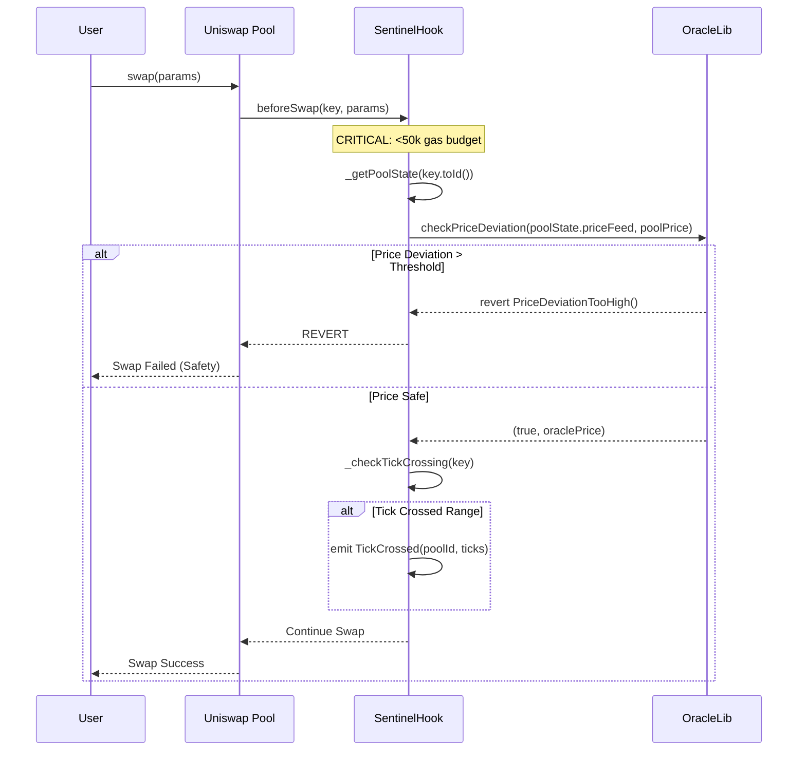
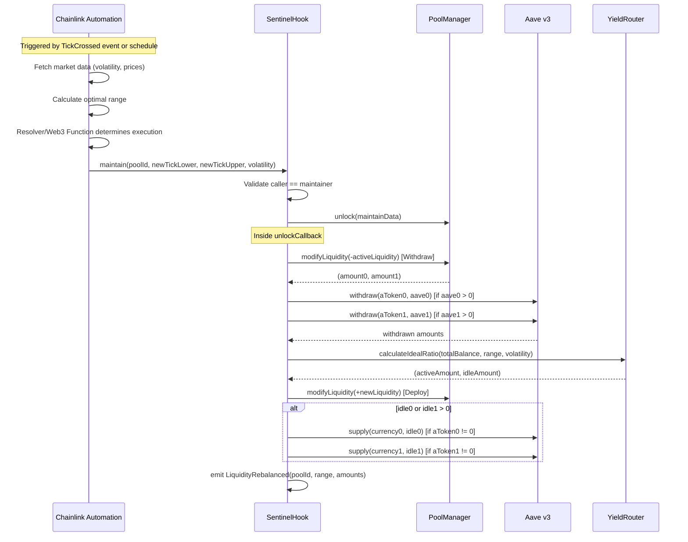

# Sentinel Liquidity Protocol: Agent Context

This document is the **Source of Truth** for AI coding agents (Copilot, Cursor, etc.) working on the Sentinel Liquidity Protocol. It defines the architecture, critical paths, and development standards.

---

## 1. Project Identity

**Name:** Sentinel Liquidity Protocol  
**Type:** Trust-Minimized Agentic Liquidity Management as a Service for Uniswap v4  
**Core Mechanic:** Hybrid architecture combining an **Immutable Multi-Pool Hook** (Safety) with **Chainlink Automation + Functions** (Execution)  
**Value Proposition:** LPs deposit liquidity, and Sentinel autonomously manages their positions across ANY Uniswap v4 pool with the hook attached—optimizing range, maximizing yield, and minimizing impermanent loss.

---

## 2. Key Design Principles

### 2.1 Multi-Pool Architecture
- **One Hook, Infinite Pools:** A single `SentinelHook` contract can be attached to ANY Uniswap v4 pool at initialization
- **Per-Pool State Isolation:** Each pool has its own isolated state (active range, LP shares, yield positions)
- **Universal LP Registry:** LPs can provide liquidity to multiple pools through a unified interface
- **Pool-Specific Oracles:** Each pool can have its own Chainlink price feed for accurate deviation checks

### 2.2 LP Management Model
- **Liquidity-as-a-Service:** LPs deposit tokens, receive shares representing their proportional ownership
- **Share Token per Pool:** Each pool has its own share accounting (not a global token)
- **Automated Position Management:** Sentinel handles all rebalancing—LPs are passive
- **Pro-Rata Yield Distribution:** Yield from Aave is distributed proportionally based on share ownership

### 2.3 Asset Flow Philosophy
- **Dual-Bucket System:** Capital is split between Active (in-range Uniswap liquidity) and Idle (earning yield in Aave)
- **Dynamic Rebalancing:** Automation adjusts the Active/Idle ratio based on volatility and market conditions
- **Dual-Asset Yield:** Each pool can route BOTH tokens to Aave independently via `aToken0`/`aToken1`. Either can be disabled by setting to `address(0)`

---

## 3. Visual Architecture

### 3.1 System Overview (Multi-Pool)
```mermaid
graph TD
    subgraph "Uniswap v4 Pools with Sentinel Hook"
        Pool1[ETH/USDC Pool]
        Pool2[WBTC/ETH Pool]
        Pool3[ARB/USDC Pool]
        PoolN[... N Pools]
    end
    
    subgraph "SentinelHook.sol (Single Contract)"
        Hook[Hook Contract]
        PoolStates[(Per-Pool State)]
        LPRegistry[(LP Registry)]
    end
    
    subgraph "External Protocols"
        Aave[Aave v3 Lending]
        Oracle[Chainlink Oracles]
        Automation[Chainlink Automation]
    end
    
    Pool1 -->|beforeSwap| Hook
    Pool2 -->|beforeSwap| Hook
    Pool3 -->|beforeSwap| Hook
    PoolN -->|beforeSwap| Hook
    
    Hook --> PoolStates
    Hook --> LPRegistry
    Hook <-->|Supply/Withdraw| Aave
    Hook <-->|Price Checks| Oracle
    Automation -->|maintain(poolId)| Hook
    Hook -->|Events| Automation
```

### 3.2 Per-Pool State Structure
```
PoolId (bytes32) => PoolState {
    // Range Management
    int24 activeTickLower
    int24 activeTickUpper
    uint128 activeLiquidity
    
    // Oracle & Safety
    address priceFeed          // Chainlink oracle for this pair
    bool priceFeedInverted     // If oracle returns token0 per token1
    uint256 maxDeviationBps    // Pool-specific deviation threshold
    
    // Yield Configuration (dual-asset)
    address aToken0            // aToken for currency0 (address(0) disables yield)
    address aToken1            // aToken for currency1 (address(0) disables yield)
    uint256 idle0              // Idle balance of currency0 held by hook
    uint256 idle1              // Idle balance of currency1 held by hook
    uint256 aave0              // aToken0 shares owned by this pool
    uint256 aave1              // aToken1 shares owned by this pool
    
    // Cached Pool Config
    Currency currency0
    Currency currency1
    uint8 decimals0
    uint8 decimals1
    uint24 fee
    int24 tickSpacing
    
    // LP Accounting
    uint256 totalShares
    
    // Status
    bool isInitialized
}

// Separate mappings (not in struct):
mapping(PoolId => mapping(address => uint256)) lpShares
mapping(PoolId => address[]) registeredLPs
mapping(PoolId => mapping(address => bool)) isLPRegistered
```

### 3.3 Complete Asset Flow Diagram
```mermaid
flowchart TB
    subgraph LP_ENTRY ["LP Entry (Per Pool)"]
        LP[LP Wallet] -->|1. Approve tokens| Approve[Token Approval]
        Approve -->|2. depositLiquidity| Hook[SentinelHook]
        Hook -->|3. Mint shares| Shares[LP Shares Updated]
        Hook -->|4. Hold tokens| Contract[Hook Contract Balance]
    end
    
    subgraph MAINTAIN ["Chainlink Maintain Cycle"]
        Automation[Chainlink Automation] -->|1. Monitor TickCrossed| Events[Event Listener]
        Events -->|2. Calculate strategy| Compute[Volatility Analysis]
        Compute -->|3. Decide execution| Consensus[Resolver/Web3 Function]
        Consensus -->|4. maintain(poolId, range, vol)| MaintainCall[Hook.maintain]
    end
    
    subgraph REBALANCE ["Rebalance Execution (Per Pool)"]
        MaintainCall -->|1. Withdraw active| Withdraw[Remove LP from Uniswap]
        MaintainCall -->|2. Recall from Aave| RecallYield[Aave.withdraw]
        Withdraw --> Consolidate[Consolidate All Capital]
        RecallYield --> Consolidate
        Consolidate -->|3. Calculate split| YieldRouter[YieldRouter.calculateIdealRatio]
        YieldRouter -->|activeAmount| Deploy[Deploy to New Range]
        YieldRouter -->|idleAmount| DepositAave[Aave.supply]
        Deploy -->|modifyLiquidity| UniPool[Uniswap Pool]
        DepositAave --> AavePool[Aave Lending Pool]
    end
    
    subgraph LP_EXIT ["LP Exit (Per Pool)"]
        LPExit[LP Calls withdrawLiquidity] -->|1. Calculate share value| CalcValue[NAV Calculation]
        CalcValue -->|2. Withdraw from Aave| AaveWithdraw[Proportional Aave Withdrawal]
        CalcValue -->|3. Withdraw from Pool| PoolWithdraw[Proportional LP Removal]
        AaveWithdraw --> Combine[Combine Tokens]
        PoolWithdraw --> Combine
        Combine -->|4. Transfer to LP| Transfer[Token Transfer]
        Transfer -->|5. Burn shares| BurnShares[Shares Burned]
    end
```

### 3.4 Hot Path (Every Swap) - Gas Critical


### 3.5 Cold Path (Chainlink Automation) - Complexity Allowed


---

## 4. The Golden Rules for AI Agents

If you are an AI generating code for this project, you **MUST** adhere to these rules:

### Rule 1: Multi-Pool State Isolation
```solidity
// ✅ CORRECT: Always scope operations to a specific pool
function maintain(PoolId poolId, int24 newLower, int24 newUpper, uint256 vol) external {
    PoolState storage state = poolStates[poolId];
    // ... operations on state
}

// ❌ WRONG: Global state assumptions
function maintain(int24 newLower, int24 newUpper) external {
    activeTickLower = newLower; // This doesn't work for multi-pool!
}
```

### Rule 2: The "Hot Path" is Sacred
- `beforeSwap` runs on EVERY swap across ALL pools using this hook
- **Gas budget:** < 50,000 gas per call
- **DO NOT:** Add external calls (except pre-approved oracles)
- **DO NOT:** Write to storage (use events for signaling)
- **DO NOT:** Loop over LP arrays or pool lists

### Rule 3: PoolKey → PoolId Conversion
```solidity
// Always derive PoolId from PoolKey for state lookups
PoolId poolId = key.toId();
PoolState storage state = poolStates[poolId];
```

### Rule 4: Oracle Per Pool
Each pool may have different token pairs requiring different oracles:
```solidity
// ✅ CORRECT: Pool-specific oracle
(bool safe, ) = OracleLib.checkPriceDeviation(
    poolStates[poolId].priceFeed,  // Pool's oracle
    poolPrice,
    poolStates[poolId].maxDeviationBps
);

// ❌ WRONG: Global oracle for all pools
(bool safe, ) = OracleLib.checkPriceDeviation(globalPriceFeed, poolPrice, 500);
```

### Rule 5: LP Share Accounting is Per-Pool
```solidity
// ✅ CORRECT: Pool-scoped shares (lpShares is a separate mapping)
lpShares[poolId][msg.sender] += shares;
poolStates[poolId].totalShares += shares;

// ❌ WRONG: Global shares
globalShares[msg.sender] += shares;
```

### Rule 6: Dual-Asset Yield Configuration
- Each pool can route BOTH tokens to Aave via `aToken0` and `aToken1`
- Set to `address(0)` to disable yield for that token
- aToken addresses are configured at pool initialization via `initializePool()`

### Rule 7: Automation Maintains One Pool at a Time
```solidity
// The maintain function is pool-specific
function maintain(
    PoolId poolId,           // Which pool to rebalance
    int24 newTickLower,
    int24 newTickUpper,
    uint256 volatility
) external onlyMaintainer { ... }
```

### Rule 8: Test in Fork with Real Pools
```bash
forge test --fork-url $SEPOLIA_RPC_URL -vvv
```

---

## 5. Architecture Deep Dive

### 5.1 Contract Structure
```
SentinelHook.sol
├── State
│   ├── poolManager (IPoolManager)
│   ├── aavePool (IPool) 
│   ├── maintainer (address)
│   ├── owner (address)
│   └── poolStates (mapping PoolId => PoolState)
│
├── Hook Permissions
│   ├── beforeInitialize: true (register pool)
│   └── beforeSwap: true (circuit breaker)
│
├── LP Interface
│   ├── initializePool(PoolKey, priceFeed, priceFeedInverted, aToken0, aToken1, maxDeviationBps, tickLower, tickUpper)
│   ├── depositLiquidity(PoolId, amount0, amount1)
│   └── withdrawLiquidity(PoolId, shares)
│
├── Automation Interface  
│   └── maintain(PoolId, tickLower, tickUpper, volatility)
│
├── View Functions
│   ├── getPoolState(PoolId)
│   ├── getSharePrice(PoolId)
│   ├── getLPPosition(PoolId, address)
│   └── getTotalValueLocked(PoolId)
│
└── Internal Helpers
    ├── _beforeSwap (Hot Path)
    ├── _handleMaintain (Cold Path)
    ├── _deployLiquidity
    ├── _withdrawLiquidity
    └── _handleYield
```

### 5.2 Library Responsibilities

| Library | Purpose | Multi-Pool Aware? |
|---------|---------|-------------------|
| `OracleLib.sol` | Price deviation checks, oracle validation | Yes - accepts feed address |
| `YieldRouter.sol` | Calculate Active/Idle split ratios | Yes - stateless math |
| `AaveAdapter.sol` | Supply/withdraw from Aave v3 | Yes - accepts asset address |

### 5.3 Event Architecture (Automation Consumption)
```solidity
// Pool lifecycle
event PoolInitialized(PoolId indexed poolId, address priceFeed, bool priceFeedInverted, address aToken0, address aToken1);

// LP events (per pool)
event LPDeposited(PoolId indexed poolId, address indexed lp, uint256 amount0, uint256 amount1, uint256 sharesReceived);
event LPWithdrawn(PoolId indexed poolId, address indexed lp, uint256 amount0, uint256 amount1, uint256 sharesBurned);

// Strategy events (automation listens to these)
event TickCrossed(PoolId indexed poolId, int24 tickLower, int24 tickUpper, int24 currentTick);
event LiquidityRebalanced(PoolId indexed poolId, int24 newTickLower, int24 newTickUpper, uint256 activeAmount, int256 idleAmount);

// Yield events
event IdleCapitalDeposited(PoolId indexed poolId, address yieldProtocol, uint256 amount);
event IdleCapitalWithdrawn(PoolId indexed poolId, address yieldProtocol, uint256 amount);
```

---

## 6. Codebase Map & Critical Files

### Contracts (`/src`)
| File | Role | Key Functionality |
|------|------|-------------------|
| `SentinelHook.sol` | **Core Multi-Pool Hook** | `beforeSwap`, `maintain`, LP deposit/withdraw, per-pool state |
| `libraries/OracleLib.sol` | **Safety** | `checkPriceDeviation()` - accepts any Chainlink feed |
| `libraries/YieldRouter.sol` | **Math** | `calculateIdealRatio()` - volatility-adjusted split |
| `libraries/AaveAdapter.sol` | **Yield Integration** | Supply/withdraw for any supported Aave asset |
| `automation/SentinelAutomation.sol` | **Chainlink Automation** | Functions-driven upkeep, round-robin pool rebalancing |
| `automation/functions/rebalancer.js` | **Off-Chain Strategy** | Fetch prices, calculate volatility, determine new ticks |

### Scripts (`/script`)
| File | Role |
|------|------|
| `DeployFullDemo.s.sol` | **Full Sepolia deployment** — mock tokens, Aave, oracle, hook, pools, approvals |
| `DeploySentinel.s.sol` | Production-style deploy (real Aave + Chainlink) |
| `DeploySentinelAutomation.s.sol` | Deploy SentinelAutomation + register pools |
| `DeployMockEnvironment.s.sol` | Deploy mock environment for local testing |

### Workflows (`/workflows`)
| File | Role | Key Functionality |
|------|------|-------------------|
| `sentinel-workflow.yaml` | **Chainlink Automation** | Workflow spec for per-pool maintain triggers |

### Tests (`/test`) — 81 tests passing
| Directory | Files | Coverage |
|-----------|-------|----------|
| `unit/` | `SentinelHookUnit.t.sol`, `OracleLib.t.sol`, `YieldRouter.t.sol`, `AaveAdapter.t.sol`, `DeploySentinel.t.sol` | Core logic, per-pool state, LP accounting, oracle checks |
| `fuzz/` | `OracleLibFuzz.t.sol`, `YieldRouterFuzz.t.sol`, `AaveAdapterFuzz.t.sol`, `YieldRouterInvariant.t.sol` | Fuzz + invariant testing for math libraries |
| `integration/` | `SentinelIntegration.t.sol` | Multi-pool deployment, LP lifecycle, rebalancing |
| `mocks/` | `MockERC20`, `MockAavePool`, `MockOracle`, `MockPoolManager`, `RatioOracle`, `SentinelHookHarness` | Test infrastructure |

---

## 7. Supported Pool Types

Sentinel can manage ANY Uniswap v4 pool that:
1. Has the SentinelHook attached at initialization
2. Has at least one token supported by Aave v3 (for yield)
3. Has a corresponding Chainlink price feed (for safety)

### Example Pool Configurations
| Pool | aToken0 Yield | aToken1 Yield | Oracle | Use Case |
|------|---------------|---------------|--------|----------|
| ETH/USDC | aWETH | aUSDC | ETH/USD | Blue chip, dual yield |
| WBTC/ETH | aWBTC | aWETH | BTC/ETH | Volatile, wider ranges |
| ARB/USDC | — (disabled) | aUSDC | ARB/USD | L2 native, single-side yield |
| stETH/ETH | aStETH | aWETH | stETH/ETH | LST arbitrage, tight ranges |

---

## 8. External Resources & Documentation

- **Chainlink Automation Reference:** [docs/chainlink_automate.md](./docs/chainlink_automate.md)
- **Tech Stack Details:** [docs/tech_stack.md](./docs/tech_stack.md)
- **Visual Guide:** [VISUAL_GUIDE.md](./VISUAL_GUIDE.md)
- **Uniswap v4 Docs:** [https://docs.uniswap.org/contracts/v4/overview](https://docs.uniswap.org/contracts/v4/overview)
- **Uniswap v4 Hooks:** [https://docs.uniswap.org/contracts/v4/concepts/hooks](https://docs.uniswap.org/contracts/v4/concepts/hooks)
- **Aave v3 Docs:** [https://aave.com/docs/aave-v3/overview](https://aave.com/docs/aave-v3/overview)
- **Chainlink Data Feeds:** [https://docs.chain.link/data-feeds](https://docs.chain.link/data-feeds)

---

*Sentinel Liquidity Protocol - Autonomous Liquidity Management at Scale*
