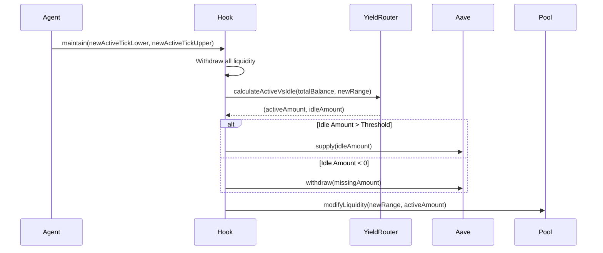

# Sentinel Liquidity Protocol: Agent Context

This document is the **Source of Truth** for AI coding agents (Copilot, Cursor, etc.) working on the Sentinel Liquidity Protocol. It defines the architecture, critical paths, and development standards.

## 1. Project Identity
**Name:** Sentinel Liquidity Protocol
**Type:** Trust-Minimized Agentic Liquidity Management for Uniswap v4.
**Core Mechanic:** Hybrid architecture combining an immutable on-chain Hook (Safety) with an off-chain Agent Swarm (Strategy).

## 2. Visual Architecture

### System Overview
```mermaid
graph TD
    User((User)) -->|Swap| Pool[Uniswap v4 Pool]
    Pool -->|beforeSwap| Hook[SentinelHook.sol]
    Hook -->|TickCrossed Event| Agent[Off-Chain Agent]
    
    subgraph On-Chain "Hot Path"
        Hook -- Check Price --> Oracle[OracleLib]
        Hook -- Check Deviation --> Revert{Safe?}
        Revert -- No --> Fail[Revert Tx]
    end
    
    subgraph Off-Chain "Cold Path"
        Agent -- Calculate --> Strategy[Volatility Strategy]
        Strategy -- Generate --> Calldata[maintain()]
    end
    
    Agent -->|maintain()| Hook
    Hook -->|Deposit Idle| Aave[Aave / Morpho]
    Hook -->|Mint New Range| Pool
```

### Rebalancing Logic


## 3. The Golden Rules for AI Agents
If you are an AI generating code for this project, you **MUST** adhere to these rules.

1.  **Trust No Math Off-Chain:** The off-chain agent can calculate whatever it wants, but the *contract* must verify safety. Never allow the `maintain()` function to withdraw funds to an arbitrary address. Funds can only go to:
    *   The Uniswap Pool (active liquidity).
    *   The Aave Lending Pool (idle yield).
    *   The specialized `collectFees` recipient (if defined).
2.  **The "Hot Path" is Sacred:** The `beforeSwap` hook runs on *every single user trade*.
    *   **Do not** add external calls (except to pre-approved Oracles).
    *   **Do not** loop over unbounded arrays.
    *   **Do not** write to storage unless absolutely necessary (events are cheaper).
3.  **Oracle Guardrails are Immutable:** The standard deviation threshold for the circuit breaker should be set at deployment or governed by a specific time-lock. It should never be modifiable by the Agent alone.
4.  **Yield is Secondary to Safety:** If Aave integration fails (e.g., paused protocol), the system must fallback gracefully (keep funds idle in the Hook) rather than reverting the entire rebalance.
5.  **Test in Fork:** Unit tests are insufficient for Aave/Uniswap integration. Always prefer `forge test --fork-url` patterns for strategy validation.

## 4. Architecture Deep Dive

### A. The Hot Path (On-Chain Guardrails)
*   **Component:** `SentinelHook.sol`
*   **Trigger:** `beforeSwap`
*   **Constraint:** Gas efficiency is paramount.
*   **Logic:**
    ```solidity
    function beforeSwap(...) internal {
        // 1. Cheap check: Is the new tick really far?
        // 2. Oracle check: Is the pool price manipulated?
        if (OracleLib.isDeviating(poolManager, 2%)) revert PriceDeviation();
        // 3. Signal: Emit event for Agent to wake up
        emit TickCrossed(currentTick);
    }
    ```

### B. The Cold Path (Off-Chain Strategy)
*   **Component:** `agent/bot.ts`
*   **Trigger:** Event Listener
*   **Logic:**
    *   **Analyzes** historical volatility (not just current price).
    *   **Optimizes** for Gas vs. Fees. If `rebalanceCost > expectedFees`, do nothing.
    *   **Executes** strictly typed transactions.

### C. Trust Minimization Philosophy
The Agent is a "Strategist", not a "Custodian".
*   **Custodian:** Has the private key to transfer funds. (Bad)
*   **Strategist:** Has the right to call `maintain()` which *moves* funds between Safe Box A (Uniswap) and Safe Box B (Aave). (Good)
*   **Verification:** The contract ensures that `TotalAssets_After >= TotalAssets_Before - Gas/Fees`.

## 5. Codebase Map & Critical Files

### Contracts (`/contracts`)
| File | Role | Key Functionality |
| :--- | :--- | :--- |
| `src/SentinelHook.sol` | **Core** | `beforeSwap` (Guard), `maintain` (Rebalance), `_handleIdleCapital` (Yield routing). |
| `src/libraries/OracleLib.sol` | **Safety** | `checkPriceDeviation()` using Chainlink/TWAP. |
| `src/libraries/YieldRouter.sol` | **Math** | `calculateIdealRatio()`, segregates Active vs. Idle funds. |
| `src/libraries/AaveAdapter.sol` | **Integration** | `depositToAave()`, `withdrawFromAave()`. Wraps `IPool`. |

### Agent (`/agent`)
| File | Role | Key Functionality |
| :--- | :--- | :--- |
| `bot.ts` | **Controller** | Event listener loop. Orchestrates the subsystems. |
| `strategy/VolatilityIndex.ts` | **Signal** | Fetches external data (CEX/Graph) to compute range width. |
| `strategy/RebalanceLogic.ts` | **Math** | Off-chain implementation of `YieldRouter` logic to predict outcomes. |

## 6. External Resources & Docs
*   **Uniswap v4 Docs:** [https://docs.uniswap.org/contracts/v4/overview](https://docs.uniswap.org/contracts/v4/overview)
*   **Aave v3 Docs:** [https://docs.aave.com/developers/](https://docs.aave.com/developers/)
*   **Foundry Book:** [https://book.getfoundry.sh/](https://book.getfoundry.sh/)
*   **Solmate (Gas Optimized Libs):** [https://github.com/transmissions11/solmate](https://github.com/transmissions11/solmate)

---
*Created by Antigravity for automated context.*
