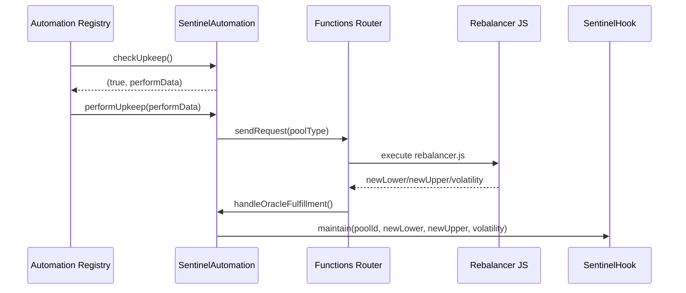
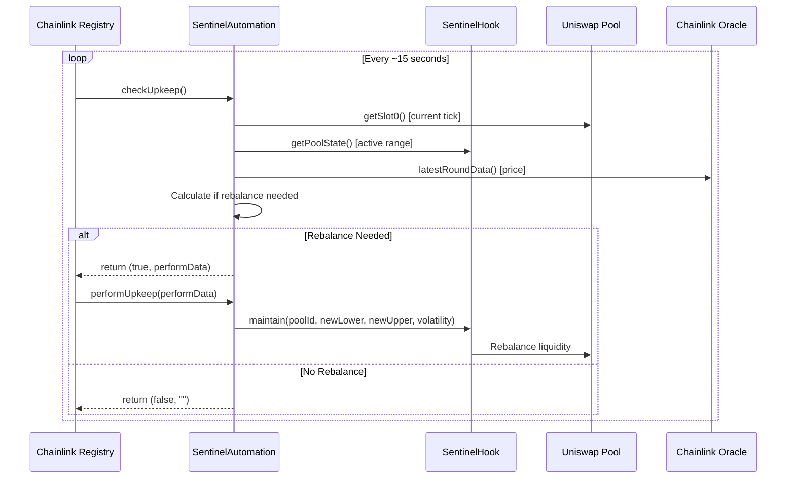
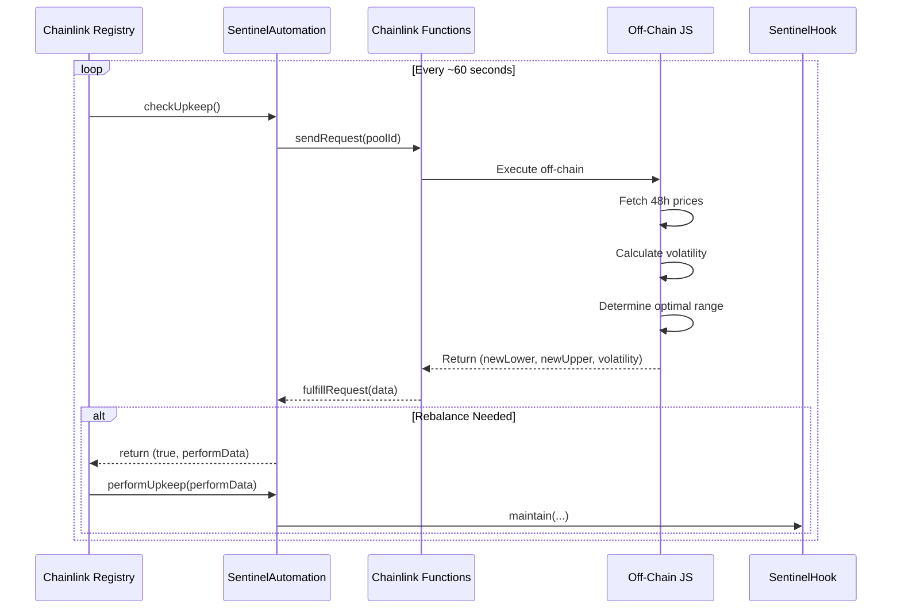

# Chainlink Automation + Functions (Sentinel)

This repository ships a **Chainlink Functions-driven Automation** flow in [src/automation/SentinelAutomation.sol](src/automation/SentinelAutomation.sol) backed by the JS source in [src/automation/functions/rebalancer.js](src/automation/functions/rebalancer.js).

## Overview

Sentinel can be rebalanced by Chainlink Automation with off-chain strategy computation via Chainlink Functions:

1. **Automation** calls `checkUpkeep()` periodically (round-robin per pool).
2. `performUpkeep()` **sends a Functions request** to compute new ticks + volatility.
3. Functions callback **calls `handleOracleFulfillment()`**, which executes `SentinelHook.maintain()`.



## Critical Oracle Needs (Simplified)

These are the minimum production-safety assumptions the agent relies on:

- **Freshness:** `updatedAt` must be recent (stale data is rejected).
- **Non‑zero price:** `answer` must be > 0.
- **Decimals normalization:** prices are scaled to 18 decimals in `OracleLib`.
- **Per‑pool inversion:** `priceFeedInverted` handles feed orientation.
- **Controlled testing:** use the on‑chain mock feed for deterministic agent runs.

For local/dev, use [src/mocks/MockPriceFeed.sol](../src/mocks/MockPriceFeed.sol) to set prices on demand.

## Contracts

- [src/automation/SentinelAutomation.sol](src/automation/SentinelAutomation.sol)
  - `checkUpkeep()` picks an active pool (round-robin).
  - `performUpkeep()` triggers a Functions request.
  - `handleOracleFulfillment()` decodes response and calls `maintain()`.
- [src/automation/functions/rebalancer.js](src/automation/functions/rebalancer.js)
  - Fetches oracle prices and 48h history.
  - Computes volatility and determines new tick range.

### Pool Types

`SentinelAutomation` expects a **pool type** to match the JS strategy:

| Pool Type | Pair | Notes |
| --- | --- | --- |
| 0 | ETH/USDC | Uses ETH/USD + USDC/USD |
| 1 | WBTC/ETH | Uses BTC/USD + ETH/USD |
| 2 | ETH/USDT | Uses ETH/USD + USDT/USD |

## Deployment

Use the following scripts:

- **Demo deploy (mock everything):** [script/DeployAll.s.sol](script/DeployAll.s.sol)
- **Automation deploy + registration:** [script/DeployAutomationFull.s.sol](script/DeployAutomationFull.s.sol)

**Required env vars (Functions mode)**:

- `PRIVATE_KEY`
- `CL_FUNCTIONS_ROUTER`
- `CL_DON_ID`
- `CL_SUB_ID`
- `CL_GAS_LIMIT`
- `CL_FUNCTIONS_SOURCE` (optional; if unset, uses [src/automation/functions/rebalancer.js](src/automation/functions/rebalancer.js))
- `DEPLOYMENT_JSON` (optional; defaults to `deployment.json` from DeployAll)

**Automation‑only env (no Functions):**

- `USE_FUNCTIONS=false`

### Deploy

Run the script to deploy the automation contract and print next steps (reads `deployment.json`):

- Script: [script/DeployAutomationFull.s.sol](script/DeployAutomationFull.s.sol)

### Register Pools

Only needed if you use [script/DeploySentinelAutomation.s.sol](script/DeploySentinelAutomation.s.sol) instead of `DeployAutomationFull`:

- `AUTOMATION_ADDRESS`
- `POOL_ID` (bytes32)
- `POOL_TYPE` (0/1/2)

### Set Maintainer

Only needed if you use [script/DeploySentinelAutomation.s.sol](script/DeploySentinelAutomation.s.sol) and want to set maintainer separately.

## Chainlink Automation for Sentinel Protocol

## Overview

This document describes how Sentinel uses **Chainlink Automation** (formerly Keepers) with optional **Chainlink Functions** for off-chain computation to manage the rebalancing strategy.

```mermaid
flowchart TB
    subgraph "Chainlink Automation (On-Chain)"
        A[Automation Registry] -->|Calls checkUpkeep| B[SentinelAutomation Contract]
        B -->|Returns true + performData| A
        A -->|Calls performUpkeep| C[SentinelHook.maintain]
    end
    
    subgraph "Optional: Chainlink Functions (Off-Chain)"
        D[Functions Router] -->|Executes JS| E[Off-Chain Computation]
        E -->|Fetch Oracle Prices| F[Chainlink Oracles]
        E -->|Calculate Volatility| G[Historical Data]
        E -->|Return calldata| D
    end
    
    B -.->|Complex logic| D
    C -->|Rebalances Pool| H[Uniswap v4 Pool]
    
```

---

## Architecture: Two Patterns

### Pattern 1: Chainlink Automation Only (Simple)
Best for: **Hackathons, MVPs, single pool**

This mode is now supported directly in `SentinelAutomation` by setting `USE_FUNCTIONS=false`.
The contract reads pool `slot0` on‑chain and recenters the range when the tick leaves the active band.



### Pattern 2: Chainlink Automation + Functions (Advanced)
Best for: **Production, multi-pool, complex volatility analysis**



---

## Implementation Guide

## Demo Mode (Automation-only)

For deterministic demos without Functions, deploy automation in **Automation-only** mode:

- Set `USE_FUNCTIONS=false`
- Run `forge script script/DeployAutomationFull.s.sol --account test1 --rpc-url $SEPOLIA_RPC_URL --broadcast -vvv`
- Register upkeep at [automation.chain.link](https://automation.chain.link/)

Pair this with mock feeds via `USE_MOCK_FEEDS=true` in the deploy script for fully controlled demos.

### Step 1: Deploy Automation

Use [script/DeployAutomationFull.s.sol](script/DeployAutomationFull.s.sol) (recommended) or
[script/DeploySentinelAutomation.s.sol](script/DeploySentinelAutomation.s.sol) for manual steps.

### Step 2: Register Upkeep + (Optional) Functions

- Register a custom logic upkeep for the deployed `SentinelAutomation`.
- If `USE_FUNCTIONS=true`, add the automation contract as a consumer to your Functions subscription.

### Step 3: Set Maintainer (If Not Done by DeployAutomationFull)

- Call `SentinelHook.setMaintainer(automationAddress)`.

---

## Testnet Addresses

### Sepolia

| Contract | Address |
|----------|---------|
| LINK Token | `0x779877A7B0D9E8603169DdbD7836e478b4624789` |
| Automation Registrar | `0xb0E49c5D0d05cbc241d68c05BC5BA1d1B7B37086` |
| Automation Registry | `0x86EFBD0b6736Bed994962f9797049422A3A8E8Ad` |

### Base Sepolia

| Contract | Address |
|----------|---------|
| LINK Token | `0xE4aB69C077896252FAFBD49EFD26B5D171A32410` |
| Automation Registrar | `0x6090149792dAAeE9D1D568c56851d6e6B17d087C` |

---

## Cost Estimation

| Network | Avg Gas per Upkeep | LINK per Upkeep | Monthly (1/hr) |
|---------|-------------------|-----------------|----------------|
| Sepolia | ~400k | ~0.1 LINK | ~72 LINK |
| Base | ~300k | ~0.05 LINK | ~36 LINK |
| Mainnet | ~400k | ~0.2 LINK | ~144 LINK |

> **Note**: Testnet LINK is free! Get from faucets.

---

## Deployment Checklist

- [ ] Deploy `SentinelHook` contract
- [ ] Deploy `SentinelAutomation` contract
- [ ] Call `hook.setMaintainer(automationAddress)`
- [ ] Add pools via `automation.addPool(poolId)`
- [ ] Get LINK from faucet (testnet)
- [ ] Register upkeep on automation.chain.link
- [ ] Fund upkeep with LINK
- [ ] Monitor on Chainlink dashboard

---

## Monitoring & Debugging

### Check Upkeep Status

```bash
cast call $AUTOMATION_ADDRESS "getPoolStatus(bytes32)" $POOL_ID --rpc-url $RPC_URL
```

### Manual Trigger (Testing)

```bash
# Simulate checkUpkeep
cast call $AUTOMATION_ADDRESS "checkUpkeep(bytes)" "0x" --rpc-url $RPC_URL

# If returns true, manually perform
cast send $AUTOMATION_ADDRESS "performUpkeep(bytes)" $PERFORM_DATA --private-key $PK --rpc-url $RPC_URL
```

### View Chainlink Dashboard

- **Sepolia**: https://automation.chain.link/sepolia
- **Base**: https://automation.chain.link/base-sepolia

---

## Optional: Chainlink Functions for Complex Logic

For advanced volatility calculations, you can integrate Chainlink Functions:

```javascript
// functions/sentinel-rebalancer.js
const poolId = args[0];
const hookAddress = args[1];

// Fetch 48h historical prices
const prices = await Functions.makeHttpRequest({
    url: `https://api.coingecko.com/api/v3/coins/ethereum/market_chart?vs_currency=usd&days=2`
});

// Calculate volatility
const priceData = prices.data.prices;
const returns = priceData.slice(1).map((p, i) => 
    (p[1] - priceData[i][1]) / priceData[i][1]
);
const volatility = Math.sqrt(returns.reduce((sum, r) => sum + r*r, 0) / returns.length) * 100;

// Determine range width based on volatility
let widthTicks;
if (volatility < 5) widthTicks = 100;
else if (volatility < 15) widthTicks = 300;
else if (volatility < 30) widthTicks = 600;
else widthTicks = 1000;

return Functions.encodeUint256(widthTicks);
```

This keeps the advanced volatility logic off-chain while using Chainlink's decentralized execution!
