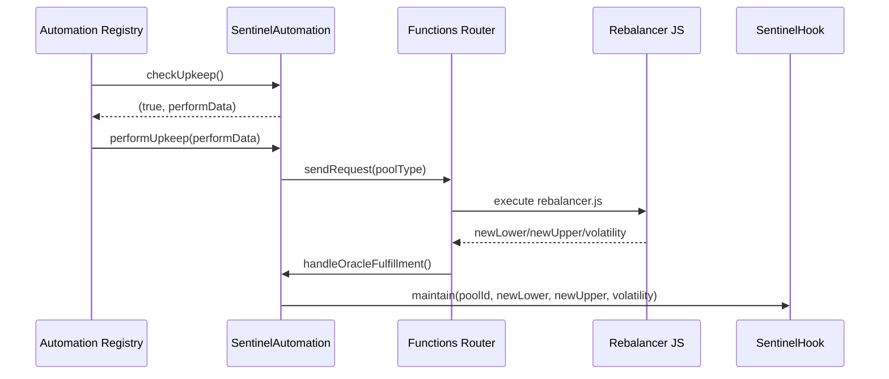
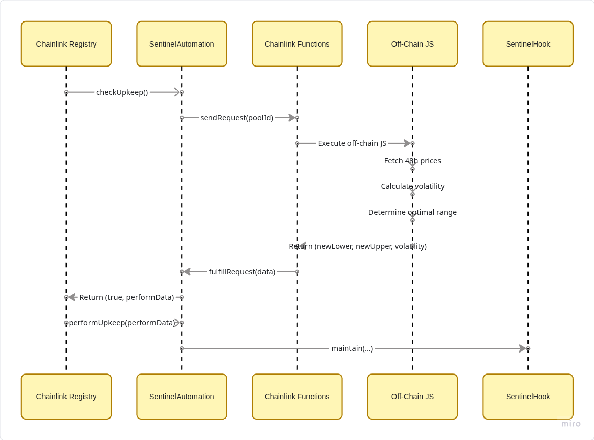
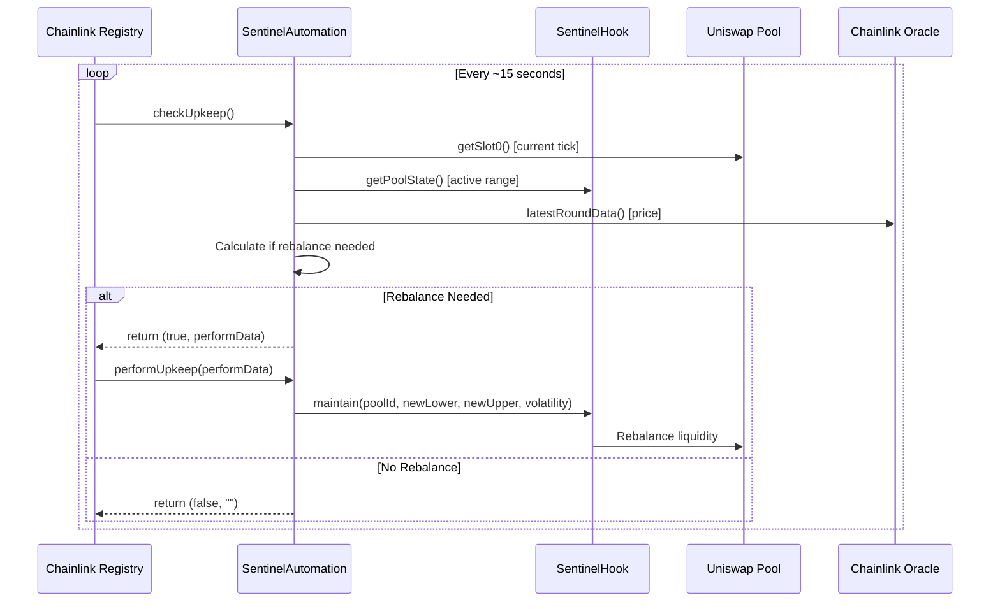
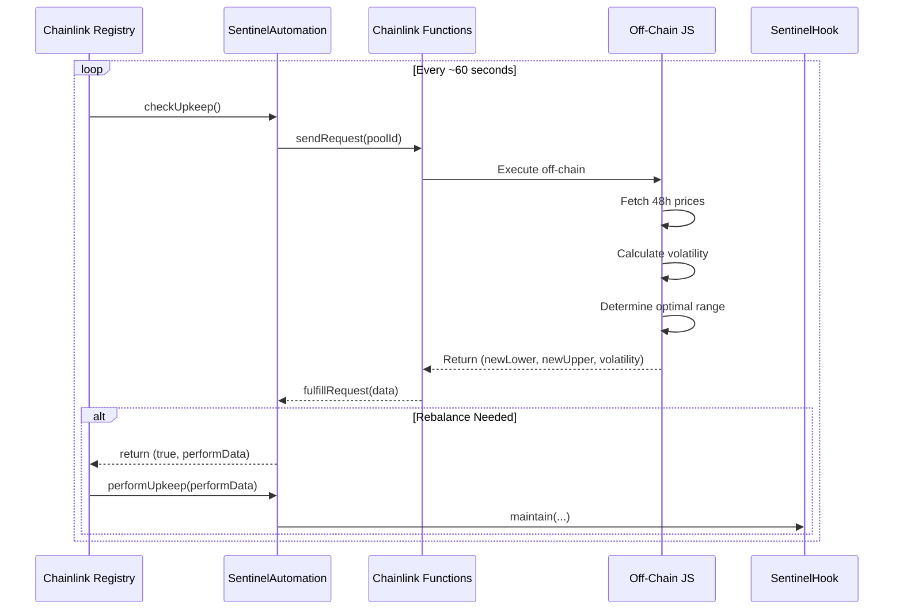

# Chainlink Automation + Functions (Sentinel)

This repository ships a **Chainlink Functions-driven Automation** flow in [src/automation/SentinelAutomation.sol](src/automation/SentinelAutomation.sol) backed by the JS source in [src/automation/functions/rebalancer.js](src/automation/functions/rebalancer.js).

## Overview

Sentinel can be rebalanced by Chainlink Automation with off-chain strategy computation via Chainlink Functions:

1. **Automation** calls `checkUpkeep()` periodically (round-robin per pool).
2. `performUpkeep()` **sends a Functions request** to compute new ticks + volatility.
3. Functions callback **calls `handleOracleFulfillment()`**, which executes `SentinelHook.maintain()`.



## Contracts

- [src/automation/SentinelAutomation.sol](src/automation/SentinelAutomation.sol)
  - `checkUpkeep()` picks an active pool (round-robin).
  - `performUpkeep()` triggers a Functions request.
  - `handleOracleFulfillment()` decodes response and calls `maintain()`.
- [src/automation/functions/rebalancer.js](src/automation/functions/rebalancer.js)
  - Fetches oracle prices and 48h history.
  - Computes volatility and determines new tick range.

### Pool Types

`SentinelAutomation` expects a **pool type** to match the JS strategy:

| Pool Type | Pair | Notes |
| --- | --- | --- |
| 0 | ETH/USDC | Uses ETH/USD + USDC/USD |
| 1 | WBTC/ETH | Uses BTC/USD + ETH/USD |
| 2 | ETH/USDT | Uses ETH/USD + USDT/USD |

## Deployment

Use the deployment script [script/DeploySentinelAutomation.s.sol](script/DeploySentinelAutomation.s.sol).

**Required env vars**:

- `PRIVATE_KEY`
- `SENTINEL_HOOK_ADDRESS`
- `CL_FUNCTIONS_ROUTER`
- `CL_DON_ID`
- `CL_SUB_ID`
- `CL_GAS_LIMIT`
- `CL_FUNCTIONS_SOURCE` (optional; if unset, uses [src/automation/functions/rebalancer.js](src/automation/functions/rebalancer.js))

### Deploy

Run the script to deploy the automation contract and print next steps:

- Script: [script/DeploySentinelAutomation.s.sol](script/DeploySentinelAutomation.s.sol)

### Register Pools

Register one pool at a time with env vars:

- `AUTOMATION_ADDRESS`
- `POOL_ID` (bytes32)
- `POOL_TYPE` (0/1/2)

### Set Maintainer

Once the automation contract is deployed, set it as the hook maintainer:

- `SENTINEL_HOOK_ADDRESS`
- `AUTOMATION_ADDRESS`

## Chainlink Automation for Sentinel Protocol

## Overview

This document describes how Sentinel uses **Chainlink Automation** (formerly Keepers) with optional **Chainlink Functions** for off-chain computation to manage the rebalancing strategy.

```mermaid
flowchart TB
    subgraph "Chainlink Automation (On-Chain)"
        A[Automation Registry] -->|Calls checkUpkeep| B[SentinelAutomation Contract]
        B -->|Returns true + performData| A
        A -->|Calls performUpkeep| C[SentinelHook.maintain]
    end
    
    subgraph "Optional: Chainlink Functions (Off-Chain)"
        D[Functions Router] -->|Executes JS| E[Off-Chain Computation]
        E -->|Fetch Oracle Prices| F[Chainlink Oracles]
        E -->|Calculate Volatility| G[Historical Data]
        E -->|Return calldata| D
    end
    
    B -.->|Complex logic| D
    C -->|Rebalances Pool| H[Uniswap v4 Pool]
    
```

---

## Architecture: Two Patterns

### Pattern 1: Chainlink Automation Only (Simple)
Best for: **Hackathons, MVPs, single pool**



### Pattern 2: Chainlink Automation + Functions (Advanced)
Best for: **Production, multi-pool, complex volatility analysis**



---

## Implementation Guide

### Step 1: Deploy the Automation Contract

Create `src/automation/SentinelAutomation.sol`:

```solidity
// SPDX-License-Identifier: MIT
pragma solidity ^0.8.24;

import {AutomationCompatibleInterface} from "@chainlink/contracts/src/v0.8/automation/AutomationCompatible.sol";
import {AggregatorV3Interface} from "@chainlink/contracts/src/v0.8/shared/interfaces/AggregatorV3Interface.sol";
import {IPoolManager} from "@uniswap/v4-core/src/interfaces/IPoolManager.sol";
import {PoolId} from "@uniswap/v4-core/src/types/PoolId.sol";
import {StateLibrary} from "@uniswap/v4-core/src/libraries/StateLibrary.sol";

interface ISentinelHook {
    struct PoolState {
        int24 activeTickLower;
        int24 activeTickUpper;
        uint128 activeLiquidity;
        address priceFeed;
        uint256 maxDeviationBps;
        address aToken0;
        address aToken1;
        address currency0;
        address currency1;
        uint256 totalShares;
        bool isInitialized;
    }
    
    function poolStates(PoolId poolId) external view returns (PoolState memory);
    function maintain(PoolId poolId, int24 newLower, int24 newUpper, uint256 volatility) external;
}

/// @title SentinelAutomation
/// @notice Chainlink Automation compatible contract for Sentinel rebalancing
contract SentinelAutomation is AutomationCompatibleInterface {
    using StateLibrary for IPoolManager;

    // ========== STATE ==========
    ISentinelHook public immutable hook;
    IPoolManager public immutable poolManager;
    
    // Tracked pools
    PoolId[] public trackedPools;
    mapping(PoolId => bool) public isTracked;
    
    // Configuration
    uint256 public checkInterval = 60; // seconds between checks
    uint256 public lastCheckTime;
    int24 public defaultTickWidth = 600; // ~6% range
    
    // Owner
    address public owner;

    // ========== EVENTS ==========
    event PoolAdded(PoolId indexed poolId);
    event PoolRemoved(PoolId indexed poolId);
    event RebalanceTriggered(PoolId indexed poolId, int24 newLower, int24 newUpper);

    // ========== ERRORS ==========
    error Unauthorized();
    error PoolNotTracked();
    error TooSoon();

    // ========== CONSTRUCTOR ==========
    constructor(address _hook, address _poolManager) {
        hook = ISentinelHook(_hook);
        poolManager = IPoolManager(_poolManager);
        owner = msg.sender;
        lastCheckTime = block.timestamp;
    }

    // ========== MODIFIERS ==========
    modifier onlyOwner() {
        if (msg.sender != owner) revert Unauthorized();
        _;
    }

    // ========== ADMIN FUNCTIONS ==========
    function addPool(PoolId poolId) external onlyOwner {
        if (!isTracked[poolId]) {
            trackedPools.push(poolId);
            isTracked[poolId] = true;
            emit PoolAdded(poolId);
        }
    }

    function removePool(PoolId poolId) external onlyOwner {
        if (!isTracked[poolId]) revert PoolNotTracked();
        isTracked[poolId] = false;
        // Note: Does not remove from array, just marks as untracked
        emit PoolRemoved(poolId);
    }

    function setCheckInterval(uint256 _interval) external onlyOwner {
        checkInterval = _interval;
    }

    function setDefaultTickWidth(int24 _width) external onlyOwner {
        defaultTickWidth = _width;
    }

    // ========== CHAINLINK AUTOMATION INTERFACE ==========
    
    /// @notice Called by Chainlink nodes to check if upkeep is needed
    /// @dev Returns true if any tracked pool needs rebalancing
    function checkUpkeep(bytes calldata /* checkData */)
        external
        view
        override
        returns (bool upkeepNeeded, bytes memory performData)
    {
        // Rate limiting
        if (block.timestamp < lastCheckTime + checkInterval) {
            return (false, "");
        }

        // Check each tracked pool
        for (uint256 i = 0; i < trackedPools.length; i++) {
            PoolId poolId = trackedPools[i];
            if (!isTracked[poolId]) continue;

            (bool needsRebalance, int24 newLower, int24 newUpper, uint256 volatility) = 
                _checkPoolNeedsRebalance(poolId);

            if (needsRebalance) {
                performData = abi.encode(poolId, newLower, newUpper, volatility);
                return (true, performData);
            }
        }

        return (false, "");
    }

    /// @notice Called by Chainlink nodes to perform the upkeep
    function performUpkeep(bytes calldata performData) external override {
        (PoolId poolId, int24 newLower, int24 newUpper, uint256 volatility) = 
            abi.decode(performData, (PoolId, int24, int24, uint256));

        // Verify the pool still needs rebalancing (prevent frontrunning)
        (bool stillNeeded, , , ) = _checkPoolNeedsRebalance(poolId);
        if (!stillNeeded) return;

        // Execute rebalance
        hook.maintain(poolId, newLower, newUpper, volatility);
        lastCheckTime = block.timestamp;

        emit RebalanceTriggered(poolId, newLower, newUpper);
    }

    // ========== INTERNAL LOGIC ==========

    /// @notice Check if a specific pool needs rebalancing
    function _checkPoolNeedsRebalance(PoolId poolId)
        internal
        view
        returns (bool needsRebalance, int24 newLower, int24 newUpper, uint256 volatility)
    {
        ISentinelHook.PoolState memory state = hook.poolStates(poolId);
        if (!state.isInitialized) return (false, 0, 0, 0);

        // Get current tick from pool
        (uint160 sqrtPriceX96, int24 currentTick, , ) = poolManager.getSlot0(poolId);

        // Safety Check: Is price outside active range?
        bool outOfRange = currentTick < state.activeTickLower || 
                          currentTick > state.activeTickUpper;

        if (outOfRange) {
            // URGENT: Rebalance immediately
            newLower = _alignTick(currentTick - defaultTickWidth, 60);
            newUpper = _alignTick(currentTick + defaultTickWidth, 60);
            volatility = 1500; // Assume high volatility when out of range
            return (true, newLower, newUpper, volatility);
        }

        // Optimization Check: Is price near edge of range?
        int24 rangeWidth = state.activeTickUpper - state.activeTickLower;
        int24 edgeThreshold = rangeWidth / 5; // 20% buffer

        bool nearLowerEdge = (currentTick - state.activeTickLower) < edgeThreshold;
        bool nearUpperEdge = (state.activeTickUpper - currentTick) < edgeThreshold;

        if (nearLowerEdge || nearUpperEdge) {
            // Optional: Trigger proactive rebalance
            newLower = _alignTick(currentTick - defaultTickWidth, 60);
            newUpper = _alignTick(currentTick + defaultTickWidth, 60);
            volatility = 1000; // Medium volatility
            return (true, newLower, newUpper, volatility);
        }

        return (false, 0, 0, 0);
    }

    /// @notice Align tick to spacing
    function _alignTick(int24 tick, int24 spacing) internal pure returns (int24) {
        return (tick / spacing) * spacing;
    }

    // ========== VIEW FUNCTIONS ==========

    function getTrackedPoolCount() external view returns (uint256) {
        return trackedPools.length;
    }

    function getPoolStatus(PoolId poolId) 
        external 
        view 
        returns (
            bool tracked,
            bool needsRebalance,
            int24 currentTick,
            int24 activeLower,
            int24 activeUpper
        ) 
    {
        tracked = isTracked[poolId];
        if (!tracked) return (false, false, 0, 0, 0);

        ISentinelHook.PoolState memory state = hook.poolStates(poolId);
        (, currentTick, , ) = poolManager.getSlot0(poolId);
        activeLower = state.activeTickLower;
        activeUpper = state.activeTickUpper;
        
        (needsRebalance, , , ) = _checkPoolNeedsRebalance(poolId);
    }
}
```

---

### Step 2: Deploy Script

Create `script/DeploySentinelAutomation.s.sol`:

```solidity
// SPDX-License-Identifier: MIT
pragma solidity ^0.8.24;

import {Script} from "forge-std/Script.sol";
import {SentinelAutomation} from "../src/automation/SentinelAutomation.sol";

contract DeploySentinelAutomation is Script {
    function run() external {
        uint256 deployerPrivateKey = vm.envUint("PRIVATE_KEY");
        address hookAddress = vm.envAddress("SENTINEL_HOOK_ADDRESS");
        address poolManagerAddress = vm.envAddress("POOL_MANAGER_ADDRESS");

        vm.startBroadcast(deployerPrivateKey);
        
        SentinelAutomation automation = new SentinelAutomation(
            hookAddress,
            poolManagerAddress
        );
        
        vm.stopBroadcast();

        console.log("SentinelAutomation deployed at:", address(automation));
    }
}
```

---

### Step 3: Register with Chainlink Automation

#### Option A: Chainlink Automation UI (Recommended for Hackathons)

1. **Go to**: https://automation.chain.link/
2. **Connect Wallet**: Use the deployer wallet
3. **Register New Upkeep**:
   - **Trigger**: Custom Logic
   - **Target Contract**: `SentinelAutomation` address
   - **Gas Limit**: 500,000
   - **Starting Balance**: 5 LINK (testnet)
4. **Fund the Upkeep** with LINK tokens

#### Option B: Programmatic Registration

```solidity
// In your deploy script:
IAutomationRegistrar registrar = IAutomationRegistrar(REGISTRAR_ADDRESS);

RegistrationParams memory params = RegistrationParams({
    name: "Sentinel Rebalancer",
    encryptedEmail: "",
    upkeepContract: address(automation),
    gasLimit: 500000,
    adminAddress: msg.sender,
    triggerType: 0, // Conditional
    checkData: "",
    triggerConfig: "",
    offchainConfig: "",
    amount: 5 ether // 5 LINK
});

registrar.registerUpkeep(params);
```

---

### Step 4: Configure the Hook

After deploying, set the automation contract as the maintainer:

```solidity
// Call on SentinelHook:
hook.setMaintainer(address(sentinelAutomation));
```

---

## Testnet Addresses

### Sepolia

| Contract | Address |
|----------|---------|
| LINK Token | `0x779877A7B0D9E8603169DdbD7836e478b4624789` |
| Automation Registrar | `0xb0E49c5D0d05cbc241d68c05BC5BA1d1B7B37086` |
| Automation Registry | `0x86EFBD0b6736Bed994962f9797049422A3A8E8Ad` |

### Base Sepolia

| Contract | Address |
|----------|---------|
| LINK Token | `0xE4aB69C077896252FAFBD49EFD26B5D171A32410` |
| Automation Registrar | `0x6090149792dAAeE9D1D568c56851d6e6B17d087C` |

---

## Cost Estimation

| Network | Avg Gas per Upkeep | LINK per Upkeep | Monthly (1/hr) |
|---------|-------------------|-----------------|----------------|
| Sepolia | ~400k | ~0.1 LINK | ~72 LINK |
| Base | ~300k | ~0.05 LINK | ~36 LINK |
| Mainnet | ~400k | ~0.2 LINK | ~144 LINK |

> **Note**: Testnet LINK is free! Get from faucets.

---

## Deployment Checklist

- [ ] Deploy `SentinelHook` contract
- [ ] Deploy `SentinelAutomation` contract
- [ ] Call `hook.setMaintainer(automationAddress)`
- [ ] Add pools via `automation.addPool(poolId)`
- [ ] Get LINK from faucet (testnet)
- [ ] Register upkeep on automation.chain.link
- [ ] Fund upkeep with LINK
- [ ] Monitor on Chainlink dashboard

---

## Monitoring & Debugging

### Check Upkeep Status

```bash
cast call $AUTOMATION_ADDRESS "getPoolStatus(bytes32)" $POOL_ID --rpc-url $RPC_URL
```

### Manual Trigger (Testing)

```bash
# Simulate checkUpkeep
cast call $AUTOMATION_ADDRESS "checkUpkeep(bytes)" "0x" --rpc-url $RPC_URL

# If returns true, manually perform
cast send $AUTOMATION_ADDRESS "performUpkeep(bytes)" $PERFORM_DATA --private-key $PK --rpc-url $RPC_URL
```

### View Chainlink Dashboard

- **Sepolia**: https://automation.chain.link/sepolia
- **Base**: https://automation.chain.link/base-sepolia

---

## Optional: Chainlink Functions for Complex Logic

For advanced volatility calculations, you can integrate Chainlink Functions:

```javascript
// functions/sentinel-rebalancer.js
const poolId = args[0];
const hookAddress = args[1];

// Fetch 48h historical prices
const prices = await Functions.makeHttpRequest({
    url: `https://api.coingecko.com/api/v3/coins/ethereum/market_chart?vs_currency=usd&days=2`
});

// Calculate volatility
const priceData = prices.data.prices;
const returns = priceData.slice(1).map((p, i) => 
    (p[1] - priceData[i][1]) / priceData[i][1]
);
const volatility = Math.sqrt(returns.reduce((sum, r) => sum + r*r, 0) / returns.length) * 100;

// Determine range width based on volatility
let widthTicks;
if (volatility < 5) widthTicks = 100;
else if (volatility < 15) widthTicks = 300;
else if (volatility < 30) widthTicks = 600;
else widthTicks = 1000;

return Functions.encodeUint256(widthTicks);
```

This keeps the advanced volatility logic off-chain while using Chainlink's decentralized execution!
