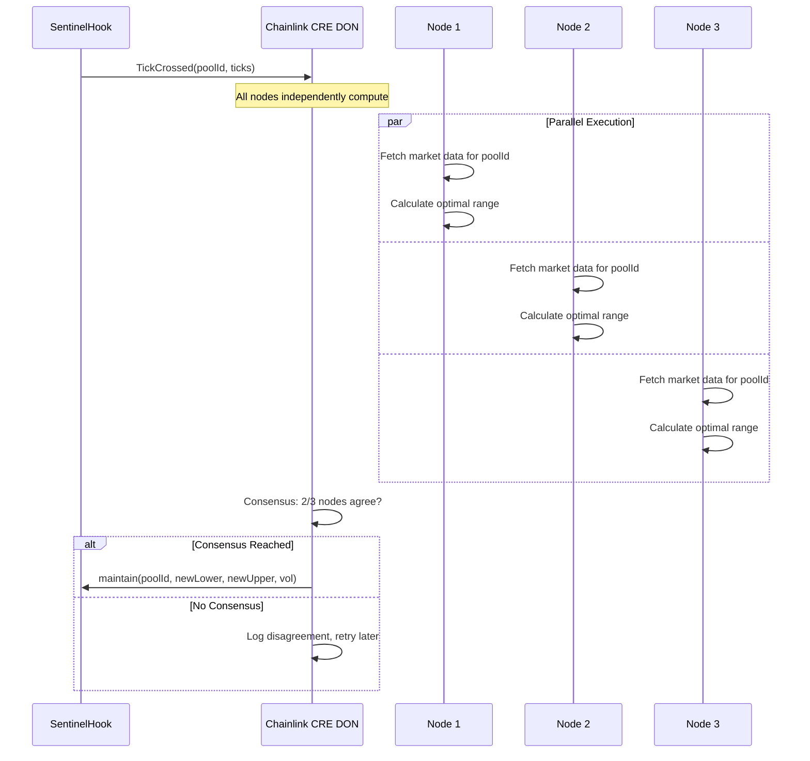
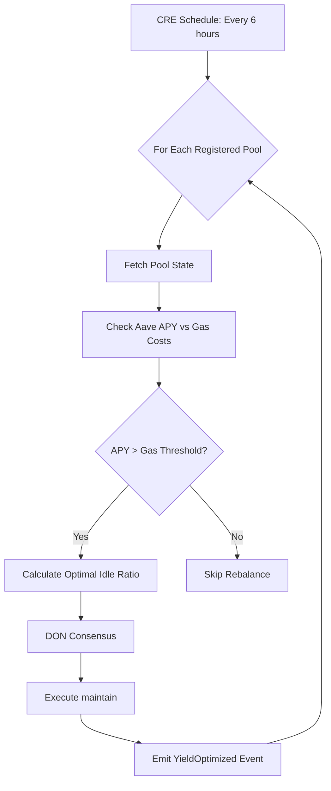

# Chainlink Runtime Environment (CRE) Reference (Legacy)

> DEPRECATED in the `gelato` branch: Sentinel uses **Gelato Automate** for the cold-path executor.
> See `docs/gelato_automate.md`.

## Overview
The **Chainlink Runtime Environment (CRE)** is an institutional-grade orchestration layer that replaces traditional off-chain bots with secure, decentralized workflows. In the Sentinel Liquidity Protocol, CRE acts as the **"Strategist"**, managing liquidity rebalancing and yield optimization across **multiple Uniswap v4 pools** without a single point of failure.

---

## Key Concepts

### 1. Workflows
A **Workflow** is a program that defines the logic for connecting distinct capabilities (e.g., triggers, data fetching, computation, and consensus). 

**Sentinel Role:** The Sentinel Workflow is triggered by on-chain events (`TickCrossed`) or time-based schedules. It computes the new optimal range for a specific pool and orchestrates the `maintain(poolId, ...)` transaction.

### 2. Capabilities
Capabilities are the building blocks of a workflow:

| Capability | Purpose | Sentinel Use Case |
|------------|---------|-------------------|
| **Triggers** | Listen for events on Uniswap v4 | `TickCrossed(poolId, ticks)` event monitoring |
| **Actions** | Fetch price data, calculate volatility | Get ETH/USD, BTC/USD, compute IV |
| **Consensus** | DON reaches agreement on rebalance params | 2/3 nodes must agree on new range |
| **Targets** | Submit transaction to destination chain | Call `maintain(poolId, tickLower, tickUpper, volatility)` |

### 3. Decentralized Oracle Networks (DONs)
Instead of a single server running a TypeScript bot, a **DON** executes the workflow. This ensures:
- **Liveness:** If one node fails, others ensure the rebalance happens
- **Security:** Malicious actors cannot alter the strategy logic without compromising the entire network consensus
- **Multi-Pool Monitoring:** A single DON can monitor events across all Sentinel-managed pools

---

## Why CRE for Sentinel?

| Feature | Legacy Bot (TypeScript) | Chainlink CRE |
| :--- | :--- | :--- |
| **Infrastructure** | Requires hosting (AWS/VPS) | Serverless, Decentralized |
| **Security** | Single Key Risk | Multi-party Computation / Consensus |
| **Trust** | "Trust me, I'm a bot" | Cryptographically Verified Execution |
| **Connectivity** | Manual RPC management | Native Interoperability |
| **Multi-Pool** | Multiple bot instances | Single workflow, multiple pool IDs |
| **LP Safety** | Bot can drain funds | Hook validates all operations |

---

## Multi-Pool Workflow Architecture

### Event-Driven Triggers
```yaml
# CRE listens for TickCrossed events from ANY pool using Sentinel Hook
trigger:
  type: event
  contract: SentinelHook
  event: TickCrossed(PoolId indexed poolId, int24 tickLower, int24 tickUpper, int24 currentTick)
  chain: Base
  
  # Fallback: periodic health check for all registered pools
  fallback:
    type: cron
    schedule: "0 */4 * * *"  # Every 4 hours
```

### Per-Pool Strategy Execution


---

## Conceptual Workflow Definition

```yaml
name: sentinel-multi-pool-manager
version: 2.0.0
description: Decentralized liquidity management across all Sentinel pools

# ===================================================================
# TRIGGER: Monitor TickCrossed events from any pool
# ===================================================================
trigger:
  type: event
  contract: "${SENTINEL_HOOK_ADDRESS}"
  event: TickCrossed
  abi:
    - "event TickCrossed(bytes32 indexed poolId, int24 tickLower, int24 tickUpper, int24 currentTick)"
  chain: base-mainnet
  
  fallback:
    type: cron
    schedule: "0 */6 * * *"

# ===================================================================
# STEP 1: Identify Pool and Fetch Configuration
# ===================================================================
steps:
  - name: get_pool_config
    action: read_contract
    contract: "${SENTINEL_HOOK_ADDRESS}"
    function: "getPoolState(bytes32 poolId)"
    args:
      poolId: "${trigger.poolId}"
    output: poolConfig
    description: "Get pool-specific oracle and yield configuration"

  - name: fetch_oracle_price
    action: read_contract
    contract: "${poolConfig.priceFeed}"
    function: "latestRoundData()"
    output: oracleData

  - name: fetch_market_volatility
    action: http_get
    url: "https://api.coingecko.com/api/v3/simple/price"
    params:
      ids: "${poolConfig.baseAsset}"
      vs_currencies: "usd"
      include_24hr_change: "true"
    output: marketData

# ===================================================================
# STEP 2: Compute Optimal Strategy for This Pool
# ===================================================================
  - name: calculate_strategy
    action: compute
    language: javascript
    code: |
      // Pool-specific volatility calculation
      const priceChange = Math.abs(marketData.price_change_24h || 0);
      const volatilityBps = Math.floor(priceChange * 100);
      
      // Dynamic range based on volatility
      let rangeWidth;
      if (volatilityBps < 200) {
        rangeWidth = 200;  // Low vol: tight range
      } else if (volatilityBps < 500) {
        rangeWidth = 600;  // Medium vol: medium range
      } else {
        rangeWidth = 1500; // High vol: wide range
      }
      
      const currentTick = trigger.currentTick;
      const tickSpacing = poolConfig.tickSpacing || 60;
      
      const newTickLower = Math.floor((currentTick - rangeWidth/2) / tickSpacing) * tickSpacing;
      const newTickUpper = Math.ceil((currentTick + rangeWidth/2) / tickSpacing) * tickSpacing;
      
      return {
        poolId: trigger.poolId,
        newTickLower,
        newTickUpper,
        volatility: volatilityBps,
        rangeWidth: newTickUpper - newTickLower
      };
    output: strategyResult

# ===================================================================
# STEP 3: DON Consensus on Strategy Parameters
# ===================================================================
  - name: consensus
    action: report_consensus
    input:
      poolId: "${strategyResult.poolId}"
      newTickLower: "${strategyResult.newTickLower}"
      newTickUpper: "${strategyResult.newTickUpper}"
      volatility: "${strategyResult.volatility}"
    threshold: 0.66  # 2/3 nodes must agree
    
    validation:
      - check: "strategyResult.newTickLower < trigger.currentTick"
        error: "Lower tick must be below current tick"
      - check: "strategyResult.newTickUpper > trigger.currentTick"
        error: "Upper tick must be above current tick"
      - check: "strategyResult.rangeWidth >= 100"
        error: "Range too narrow (minimum 100 ticks)"
      - check: "strategyResult.rangeWidth <= 5000"
        error: "Range too wide (maximum 5000 ticks)"

# ===================================================================
# STEP 4: Execute Pool-Specific Rebalancing
# ===================================================================
  - name: execute_maintain
    action: write_contract
    contract: "${SENTINEL_HOOK_ADDRESS}"
    function: "maintain"
    args:
      poolId: "${strategyResult.poolId}"
      newTickLower: "${strategyResult.newTickLower}"
      newTickUpper: "${strategyResult.newTickUpper}"
      volatility: "${strategyResult.volatility}"
    gas_limit: 600000
    condition: "${consensus.approved == true}"

# ===================================================================
# STEP 5: Post-Execution Verification
# ===================================================================
  - name: verify_rebalance
    action: event_listener
    events:
      - contract: "${SENTINEL_HOOK_ADDRESS}"
        event: "LiquidityRebalanced(bytes32 indexed poolId, int24, int24, uint256, int256)"
        filter:
          poolId: "${strategyResult.poolId}"
        timeout: 300
```

---

## LP Position Management via CRE

The CRE also monitors LP positions to ensure fair share distribution:

### LP Event Monitoring
```yaml
lp_events:
  - event: LPDeposited(bytes32 indexed poolId, address indexed lp, uint256 amount0, uint256 amount1, uint256 shares)
    action: Update LP registry, verify share calculation
    
  - event: LPWithdrawn(bytes32 indexed poolId, address indexed lp, uint256 amount0, uint256 amount1, uint256 shares)
    action: Verify proportional withdrawal, check yield distribution
```

### Yield Optimization Loop


---

## Security Considerations

### What CRE CAN Do:
- ✅ Call `maintain()` with pool-specific parameters
- ✅ Suggest new tick ranges based on market conditions
- ✅ Trigger yield rebalancing between Aave and pool

### What CRE CANNOT Do:
- ❌ Withdraw LP funds directly (shares controlled by LPs)
- ❌ Bypass oracle price deviation checks (enforced in Hook)
- ❌ Set ranges outside mathematical bounds (Hook validates)
- ❌ Access funds without consensus (2/3 DON requirement)

### Trust Model
```
┌─────────────────────────────────────────────────────────────┐
│                    TRUST HIERARCHY                          │
├─────────────────────────────────────────────────────────────┤
│ Level 1: Smart Contract (SentinelHook)                     │
│ ├── Immutable safety rules                                 │
│ ├── Oracle deviation checks                                │
│ └── LP share accounting                                    │
│                                                             │
│ Level 2: Chainlink DON (CRE)                               │
│ ├── Decentralized execution (no single point of failure)  │
│ ├── Consensus-gated transactions                           │
│ └── Cryptographically verified computations                │
│                                                             │
│ Level 3: Strategy Parameters (Configurable)                │
│ ├── Volatility thresholds                                  │
│ ├── Range width bounds                                     │
│ └── Yield protocol selection                               │
└─────────────────────────────────────────────────────────────┘
```

---

## Resources
- [Chainlink Platform Docs](https://docs.chain.link/)
- [CRE Whitepaper / Architecture](https://chain.link/whitepaper)
- [Chainlink Data Feeds (Base)](https://docs.chain.link/data-feeds/price-feeds/addresses?network=base&page=1)
