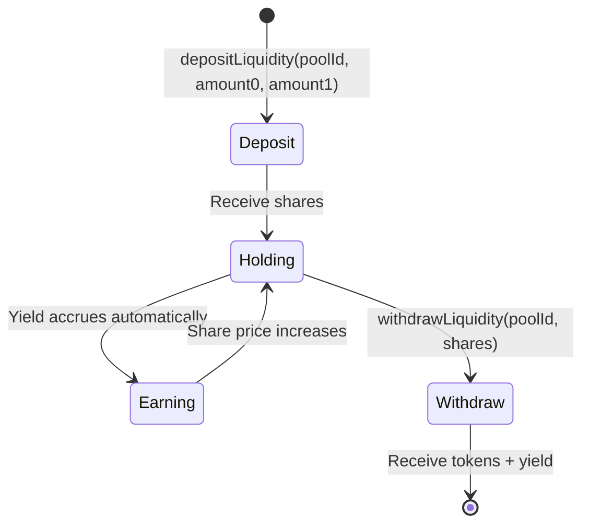

# Technology Stack & Dependencies

## Core Infrastructure

### 🦄 Uniswap v4

**Role:** The Liquidity Engine

The Sentinel Protocol is built as a **Uniswap v4 Hook** that can manage liquidity across ANY pool that attaches it.

#### Key Concepts

| Concept | Description | Sentinel Usage |
|---------|-------------|----------------|
| **PoolManager** | Singleton contract managing all pool state | Sentinel interacts via `modifyLiquidity`, `unlock` |
| **Hooks** | External contracts intercepting pool lifecycle | `SentinelHook` uses `beforeSwap` for safety |
| **PoolKey** | Identifies a unique pool (tokens, fee, tickSpacing, hook) | Converted to `PoolId` for state lookups |
| **PoolId** | Hash of PoolKey, used as mapping key | Per-pool state stored under PoolId |
| **Flash Accounting** | Transient storage for efficient token settlements | Used during `maintain()` rebalancing |

#### Hook Permissions Used
```solidity
Hooks.Permissions({
    beforeSwap: true,      // ✓ Circuit breaker (Hot Path)
    // All other hooks: false - minimal gas footprint
});
```

#### Multi-Pool Architecture
- **One Hook, Infinite Pools:** Single `SentinelHook` contract serves all pools
- **Pool-Specific State:** Each pool has isolated tick ranges, LP shares, oracle config
- **Unified Interface:** LPs interact with one contract regardless of which pool they use

**Documentation:** [Uniswap v4 Overview](https://docs.uniswap.org/contracts/v4/overview)

---

### ⚙️ Gelato Automate + 🔗 Chainlink Data Feeds

**Role:** Automation Execution + Oracle Safety

In the `gelato` branch, Sentinel uses:
- **Gelato Automate** for scheduling/event-driven execution of `maintain()` (cold path)
- **Chainlink Data Feeds** for oracle-based circuit breaking (hot path)

#### Components Used

| Component | Purpose | Sentinel Integration |
|-----------|---------|---------------------|
| **Gelato Automate** | Task execution network | Executes `maintain(poolId, ...)` via whitelisted executor |
| **Dedicated msg.sender** | Safer caller whitelisting | Hook `maintainer` set to Gelato dedicated sender (recommended) |
| **Chainlink Data Feeds** | Price oracles | Circuit breaker price validation |

#### Automation Capabilities (high level)
- **Triggers:** event-driven (e.g., `TickCrossed`) and/or cron/time
- **Dynamic inputs:** resolver and/or Web3 Functions
- **Security:** whitelist the executor via the hook’s `maintainer`

**Documentation:**
- [Gelato Automate Reference](./gelato_automate.md)
- [Gelato Docs](https://docs.gelato.cloud/)
- [Chainlink Developer Hub](https://dev.chain.link/)
- [Data Feeds (Base)](https://docs.chain.link/data-feeds/price-feeds/addresses?network=base)

---

### 👻 Aave v3

**Role:** The Yield Source

Idle capital (liquidity not currently needed in the active range) is deposited to Aave v3 to earn lending interest.

#### Integration Pattern
```
┌─────────────────────────────────────────────────────────────┐
│                    CAPITAL FLOW                             │
├─────────────────────────────────────────────────────────────┤
│ LP Deposits → SentinelHook → Split Decision                │
│                                    │                        │
│                    ┌───────────────┴───────────────┐       │
│                    ▼                               ▼       │
│              Active Capital                  Idle Capital  │
│              (Uniswap v4 Pool)              (Aave v3)      │
│                    │                               │       │
│                    └───────────────┬───────────────┘       │
│                                    ▼                        │
│                    On Withdrawal: Combine + Transfer to LP  │
└─────────────────────────────────────────────────────────────┘
```

#### Aave v3 Key Features Used

| Feature | Description | Sentinel Benefit |
|---------|-------------|------------------|
| **Supply** | Deposit assets to earn yield | Idle capital generates passive income |
| **aTokens** | Interest-bearing ERC-20 tokens | Balance automatically accrues interest |
| **Withdraw** | Redeem aTokens for underlying | On-demand liquidity for rebalancing |
| **Multiple Assets** | Each pool can use different yield asset | ETH pools → aWETH, USDC pools → aUSDC |

#### Per-Pool Yield Configuration
```solidity
struct PoolState {
    Currency yieldCurrency;  // Token deposited to Aave (one per pool)
    address aToken;          // Corresponding aToken address
    // ...
}
```

**Documentation:** [Aave v3 Developers](https://aave.com/docs/aave-v3/overview)

---

## LP Management System

### Share Token Design

Sentinel uses an internal share accounting system (not ERC-20) for capital efficiency:

```solidity
// Per-pool LP accounting
mapping(PoolId => mapping(address => uint256)) lpShares;
mapping(PoolId => uint256) totalShares;
```

#### Share Price Calculation
```
SharePrice = TotalNAV / TotalShares

Where TotalNAV = ActiveLiquidity + IdleCapital + AaveYield
```

#### LP Lifecycle



### NAV (Net Asset Value) Components

| Component | Source | Calculation |
|-----------|--------|-------------|
| **Active Liquidity** | Uniswap v4 Pool | Convert LP units to token amounts |
| **Idle Tokens** | Hook Contract Balance | Direct token balances held |
| **Aave Deposits** | aToken Balance | aToken.balanceOf(hook) |
| **Accrued Yield** | Aave Interest | aToken balance growth over time |

---

## Development Tools

### ⚒️ Foundry

**Role:** Smart Contract Framework

| Tool | Purpose | Usage |
|------|---------|-------|
| **Forge** | Compilation, testing, scripting | `forge build`, `forge test --fork-url` |
| **Cast** | CLI blockchain interaction | `cast call`, `cast send` |
| **Chisel** | Solidity REPL | Quick contract checks |
| **Anvil** | Local testnet | Fork testing with real state |

**Fork Testing Required:**
```bash
# All integration tests must run against forked mainnet/Base
forge test --fork-url $BASE_RPC_URL -vvv
```

**Documentation:** [Foundry Book](https://book.getfoundry.sh/)

---

### 📦 Library Dependencies

| Library | Purpose | Usage |
|---------|---------|-------|
| **Solmate** | Gas-optimized primitives | `ReentrancyGuard`, `SafeTransferLib` |
| **v4-core** | Uniswap v4 core contracts | `IPoolManager`, `PoolKey`, `BalanceDelta` |
| **v4-periphery** | Uniswap v4 periphery | `BaseHook`, `LiquidityAmounts` |
| **foundry-chainlink-toolkit** | Chainlink integrations | `AggregatorV3Interface` |

---

## Contract Architecture

### File Structure
```
src/
├── SentinelHook.sol              # Main multi-pool hook contract
│   ├── Per-pool state management
│   ├── LP deposit/withdraw
│   ├── beforeSwap (Hot Path)
│   └── maintain (Cold Path)
│
└── libraries/
    ├── OracleLib.sol             # Price deviation checks
    │   └── checkPriceDeviation(feed, price, maxBps)
    │
    ├── YieldRouter.sol           # Active/Idle split calculations
    │   └── calculateIdealRatio(balance, range, volatility)
    │
    └── AaveAdapter.sol           # Aave v3 integration
        ├── depositToAave(pool, asset, amount)
        ├── withdrawFromAave(pool, asset, amount)
        └── getAaveBalance(aToken, user)
```

### State Management Pattern

```solidity
// Global (immutable)
IPoolManager public immutable poolManager;
IPool public immutable aavePool;
address public maintainer;

// Per-Pool State (mutable, indexed by PoolId)
mapping(PoolId => PoolState) public poolStates;

struct PoolState {
    // Range Management
    int24 activeTickLower;
    int24 activeTickUpper;
    uint128 activeLiquidity;
    
    // Oracle & Safety
    AggregatorV3Interface priceFeed;
    uint256 maxDeviationBps;
    
    // Yield Configuration
    Currency yieldCurrency;
    address aToken;
    
    // LP Accounting
    uint256 totalShares;
    mapping(address => uint256) lpShares;
    address[] registeredLPs;
    
    // Status
    bool isInitialized;
}
```

---

## Verification & Safety

### Security Measures

| Layer | Protection | Implementation |
|-------|------------|----------------|
| **Hot Path** | Oracle circuit breaker | `OracleLib.checkPriceDeviation()` |
| **Cold Path** | Whitelisted automation executor | `maintainer` gate (Gelato dedicated msg.sender recommended) |
| **LP Funds** | Share-based accounting | Cannot withdraw more than owned |
| **Reentrancy** | ReentrancyGuard | All external-facing functions |
| **Access Control** | Role-based | `onlyMaintainer`, `onlyOwner` |

### Future Enhancements
- **Certora:** Formal verification of Hook invariants
- **Halmos:** Symbolic testing for critical paths
- **OpenZeppelin Defender:** Monitoring and alerting

---

## Network Deployments

### Base Mainnet (Target)

| Contract | Address | Role |
|----------|---------|------|
| **Uniswap PoolManager** | `0x0BFbCF9fa4f9C56B0F40a671Ad40E0805A091865` | Pool management |
| **Aave Pool** | `0xA238Dd80C259a72e81d7e4664a9801593F98d1c5` | Yield source |
| **SentinelHook** | TBD | Multi-pool hook |

### Chainlink Oracles (Base)

| Feed | Address | Usage |
|------|---------|-------|
| ETH/USD | `0x71041dddad3595F9CEd3DcCFBe3D1F4b0a16Bb70` | ETH pairs circuit breaker |
| USDC/USD | `0x7e860098F58bBFC8648a4311b374B1D669a2bc6B` | Stablecoin validation |

---

## External Resources

- **Uniswap v4 Docs:** [https://docs.uniswap.org/contracts/v4/overview](https://docs.uniswap.org/contracts/v4/overview)
- **Uniswap v4 Hooks:** [https://docs.uniswap.org/contracts/v4/concepts/hooks](https://docs.uniswap.org/contracts/v4/concepts/hooks)
- **Aave v3 Docs:** [https://aave.com/docs/aave-v3/overview](https://aave.com/docs/aave-v3/overview)
- **Chainlink Data Feeds:** [https://docs.chain.link/data-feeds](https://docs.chain.link/data-feeds)
- **Foundry Book:** [https://book.getfoundry.sh/](https://book.getfoundry.sh/)
